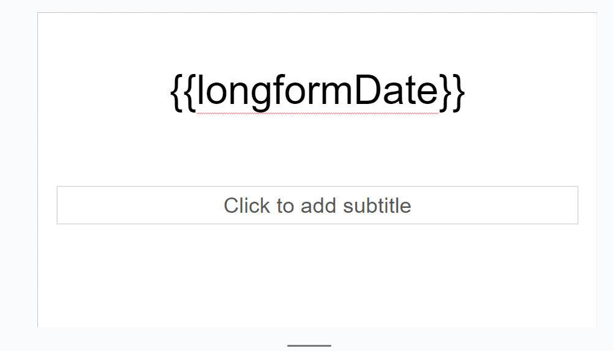

# Google Slides Lesson Planning Automation

## Overview
This project automates the creation of daily lesson presentations using Google Slides and Google Sheets. By leveraging a template-based approach, educators can quickly generate presentations with custom content pulled from a structured Google Sheet, streamlining the lesson planning process.

## About the Lesson Planning Process

This project was born out of the need to streamline the often time-consuming process of lesson planning and presentation preparation. I teach in a multi-grade classroom, and so I am responsible for planning all grade-level content for up to three grade levels at a time, as well as differentiating to meet diverse academic needs within those grade levels.

Here is an example of a [filled out](https://docs.google.com/spreadsheets/d/1elMJSBVyhlpp-Otan3VS-vsvBlPMboM3MopFKAnqJv4/edit?usp=sharing) Weekly Sheet. Students have been anonymized. You will not have access to any of the linked presentations.

Here is an example of the [Monday slides](https://docs.google.com/presentation/d/1OIAZ8rovM-rwJr2moDthnFcz9re7YykhtHp32Jx40f0/edit?usp=sharing) created from that sheet.

**Why Automate?** Creating a daily slide deck from scratch each day was time-consuming and daunting. It also made it more difficult to be flexible and move lessons around if issues arose during the school day. This lesson plan style makes it easy to move things from one day to another while remaining organized. You can see this in some of the repetion in the sheet. My Kindergarten student had some absences that week and I just moved things to the next day.

**How It Works:** The script uses a Google Sheet where lesson plans are structured, including key variables like topics, resources, and a to-do for each day. These plans are then dynamically inserted into a Google Slides template that serves as the base for daily lesson presentations. These notes keep me on track while projecting slides to the smart board and reading off my iPad. They can also be shared with classroom assistants by sharing the presentation. They also make filling out an emergency lesson plan for a sub quick and easy.

**Customizing Your Lesson Plans:** While the provided template serves as a starting point, the real power lies in customization. Whether you teach multiple subjects, follow a specific theme for your presentations, or have a unique class structure, the script and templates can be adapted to fit your specific needs and teaching style.

By sharing this process and tool, I hope to help educators spend less time on preparation and more time engaging with their students.


## Features
- **Automated Presentation Creation**: Generate Google Slides presentations from a template with the click of a button.
- **Dynamic Content Replacement**: Automatically replace placeholder text in the Google Slides template with content from a Google Sheet.
- **Speaker Notes Addition**: Insert detailed lesson plans as speaker notes into the slides, supporting complex lesson structures.

## Prerequisites
Before you start, ensure you have:
- A Google account with access to Google Drive, Google Sheets, and Google Slides.
- Basic familiarity with Google Apps Script.

## Getting the Script

To start using the Google Slides Lesson Planning Automation script, you'll first need to get a copy of the script code from this GitHub repository. Here are the steps to do this:

### Option 1: Downloading the Script Directly

1. **Navigate to the Repository**: Go to the main page of the repository on GitHub.
2. **Find the Script File**: Look for the `.gs` file(s) that contain the script you need. The primary script file is usually named something descriptive, like `LessonPlanAutomation.gs`.
3. **Download the File**: Click on the file name to view its contents. Then, click the `Raw` button near the top right of the file content view. Right-click the page and select `Save As` to download the file to your computer.

### Option 2: Cloning the Repository

If you're familiar with Git, you can also clone the entire repository to your local machine. This is a good option if you plan to explore the code further, make your own modifications, or contribute back to the project.

1. **Copy the Repository URL**: Click the `Code` button on the main repository page, and copy the URL provided.
2. **Clone the Repository**: Open a terminal on your computer, navigate to the directory where you want to store the project, and run:
   ```bash
   git clone <https://github.com/amackerman/google-slides-lesson-plan-automation.git> 

## Adding the Script to Google Apps Script
Once you have downloaded or cloned the script, the next step is to add it to Google Apps Script:

1. **Open Google Apps Script**: Go to https://script.google.com/ and sign in with your Google account.
2. **Create a New Project**: Click on New Project. You'll be taken to the script editor.
3. **Replace the Placeholder Code**: In the script editor, you'll see some placeholder content. Delete this, and paste in the code you downloaded from GitHub.
4. **Save and Name Your Project**: Give your project a meaningful name that relates to its function, such as "Lesson Planning Automation".

## Setup
1. **Google Slides Template**: Create a Google Slides presentation to serve as your template. You can get a copy of my template [here](https://docs.google.com/presentation/d/1Zk9AfzmUV4eJrP0RXU8KxehTHcq0U-FSey2meAAhGQI/copy
).
  - Define placeholders for dynamic content. The example also has a section slide for each period that is taught. These are in the same order as the rows of lesson plan notes and are where the lesson plan notes are inserted.
  - The name of the variable needs to be enclosed in **double** curly braces {{}} wherever you want them inserted.



2. **Google Sheets Preparation**: Set up a Google Sheet with two tabs: "Slide Content" for slide content variables and "Weekly Notes" for speaker notes. You can get a copy of my template [here](https://docs.google.com/spreadsheets/d/1jv21YTvJ6EkmovBMOI8bTLbIoQFbJV-zOEWQog4cbaE/copy)


   
  - The first column of "Slide Content" should contain your variables in **double** curly braces. The following comments are the values for those variables. If they are different each day of the week, you can have a column for each day.

This code will call the values for Monday.

```var templateValue = row[1]; // Assumes values are in the second column```

- Weekly notes is a custom lesson plan format. It has three columns per day. Therefore, the value for where the code finds the notes changes depending on the day.

  
-  If you need more or fewer columns, you will need to adjust your values accordingly. I keep them in a comment for easy reference.

This code will insert the speaker notes for Monday.

```addSpeakerNotesToSlides(newPresentation, spreadsheetId, "Weekly Notes", 2);//(Values are 2,5,8,11,14)```

3. **Script Configuration**: 
- In your script, set the `TEMPLATE_ID` to the ID of your Google Slides template and `TARGET_FOLDER_ID` to the ID of the folder where new presentations will be saved.

`https://drive.google.com/drive/folders/THIS_RANDOM_STRING_IS_THE_FOLDER_ID`

`https://docs.google.com/presentation/d/THIS_RANDOM_STRING_IS_THE_PRESENTATION_ID/edit#slide=id.p`

- Name your Presentation on this line

```var newFile = templateFile.makeCopy("PRESENTATION_NAME", targetFolder); // Name presentation```

- Adjust the values for Weekly Notes and template value as discussed above. 

### Authorizing the Google Apps Script

To use the Lesson Planning Automation script, you first need to authorize it to interact with your Google Drive, Sheets, and Slides. This step is crucial for the script to perform actions such as reading from a spreadsheet and creating presentations in your drive. Follow these steps to authorize your script:

1. **Open the Apps Script Project**:
   - Navigate to [Google Apps Script](https://script.google.com) and open your script project. If you're starting from a template or a shared script, make sure to save a copy of the script to your own Google Drive first.

2. **Run the Script**:
   - In the Apps Script editor, find the `createPresentation` function (or another initial function you need to run) in the dropdown menu near the top of the editor.
   - Click the play icon (`▶`) to attempt to run the function.

3. **Grant Permissions**:
   - A dialog box will appear asking you to review permissions for the script. Click `Review Permissions`.
   - Select your account and continue.
   - If you encounter a screen that says "Google hasn’t verified this app," click `Advanced` and then `Go to (your project's name) (unsafe)` to proceed.
   - Review the list of permissions the script is requesting and click `Allow` to grant them.

**Note**: The script is considered "unsafe" only because it is not verified by Google, which is typical for custom scripts. As long as you trust the source of the script, it is safe to proceed.

### Troubleshooting Authorization

If you run into issues during the authorization process:

- **Ensure Correct Account**: Make sure you are logged into the correct Google account in your browser—one that has access to the script and the necessary Google Drive files.
- **Script Function Not Found**: If you receive an error stating a script function was not found, double-check that you’ve selected the correct function in the Apps Script editor.
- **Re-run After Authorization**: Sometimes, you may need to run the script again after successfully granting permissions to kickstart the script’s functionality.

### Next Steps

Once the script is authorized and ready to go, you can proceed to using it as described in the [Usage](#usage) section below.

## Usage
- Adjust the values to correspond with your columns for the day.
- Save the changes to the sheet and click run.

## Customization

- You can add notes for as many classes/subjects as you would like; just make sure there is a corresponding slide in the template.
- You can apply a theme to your template as usual, which will apply to any created presentations. The screenshots have a theme, but the template link does not, so it is more customizable.
- 
  The created title slide:

 
 
  The same slide with a Google Slides Theme applied.


## Troubleshooting
- Double-check that IDs match for `TEMPLATE_ID`, `TARGET_FOLDER_ID`, and `spreadsheetID`, as well as the names of the tabs on the spreadsheets.

## Limitations

My lesson plan template shows that I insert other Google slides into each presentation. This is because many of these slides are commercial products, either from TeachersPayTeachers or a curriculum publisher. These slides have images and backgrounds, and Google Apps Script currently lacks the ability to copy and insert these slides into a presentation. Therefore, I must do it manually. However, having the link to a presentation in my lesson planning makes this process quick and easy.

## Feedback and Contributions

I welcome your feedback and contributions to this project! Whether you have suggestions for improvements, find a bug to report, or want to contribute code, here's how you can do it:

1. **Feedback and Suggestions**: Feel free to open an issue in the project's GitHub repository with your feedback, suggestions for improvements, or feature requests. We're always looking for ways to make our project better.

2. **Reporting Bugs**: If you encounter a bug, please open an issue on GitHub, providing as much detail as possible about the bug, how to reproduce it, and, if possible, screenshots or error messages. This information will be invaluable in helping us fix the issue quickly.

3. **Contributing code**: If you'd like to contribute code to this project, please fork the repository and submit a pull request with your changes. We recommend discussing the changes you wish to make via an issue before making a pull request to ensure that your contribution aligns with the project's goals and direction.

4. **Documentation**: Improvements to documentation or README are always appreciated. Whether you add more examples, clarify instructions, or correct typos, your help improving this documentation is welcome.

Your contributions, whether big or small, make a significant impact on the project and the community around it. Thank you for your support!


## License

This project is licensed under the MIT License - see the [LICENSE.md](LICENSE.md) file for details.

The MIT License is a simple and permissive license that allows you the freedom to use, copy, modify, merge, publish, distribute, sublicense, and/or sell copies of the Software, provided the above copyright notice and this permission notice are included in all copies or substantial portions of the Software.
